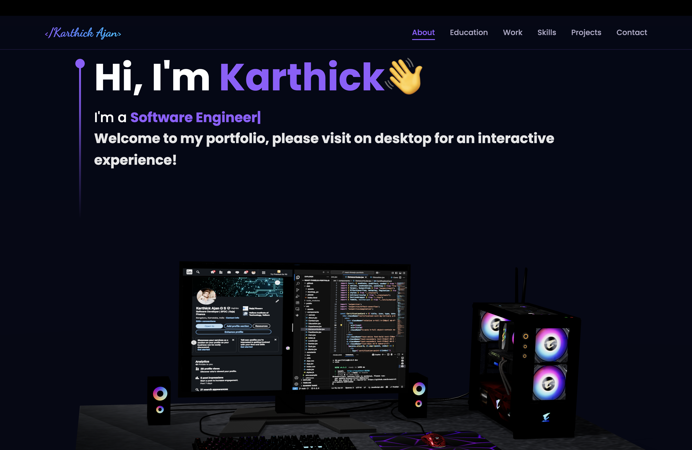
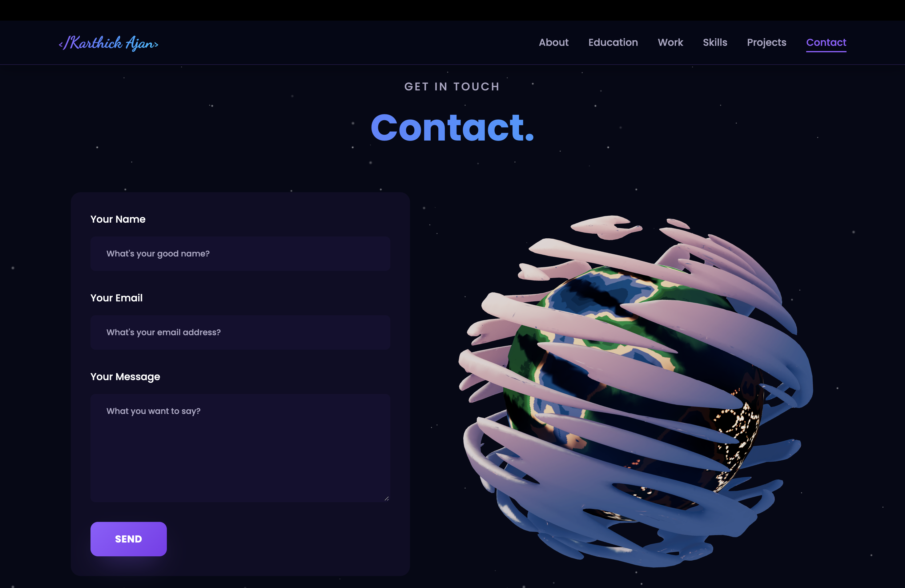

# 🚀 Karthick Ajan - Portfolio

[](https://karthickajan.github.io/Ajan/)
[](https://github.com/karthickajan/Ajan/stargazers)
[](https://github.com/karthickajan/Ajan/network/members)
[](https://github.com/karthickajan/Ajan/issues)

## 📊 Repository Stats

| Metric | Count |
|--------|-------|
| 👀 Views | <!-- VIEWS_COUNT -->256<!-- /VIEWS_COUNT --> |
| 📥 Clones | <!-- CLONES_COUNT -->1131<!-- /CLONES_COUNT --> |
| ⭐ Stars |  |
| 🍴 Forks |  |
| 👁️ Watchers |  |

> 📈 Traffic data updated daily via GitHub Actions. Full history: [traffic-history.json](traffic-data/traffic-history.json)

---

## 📸 Preview

<div align="center">
  
  
</div>

---

## ✨ Features

- 🎨 Modern, responsive design
- 🌍 Interactive 3D Earth globe
- 📧 Contact form with EmailJS integration
- 🎯 Smooth scroll animations
- 📱 Mobile-first responsive layout
- 🚀 Deployed on GitHub Pages

## 📋 Use This as Your Portfolio Template

**Want to use this for your own portfolio?** It takes ~5 minutes to customize:

1. **Fork** this repository
2. **Edit** `src/app/services/portfolio-data.service.ts` with your info
3. **Replace** images in `src/assets/` with your photos
4. **Deploy** to GitHub Pages

👉 **[See full customization guide →](PORTFOLIO_TEMPLATE.md)**

## 🛠️ Tech Stack


---

## 🚀 Getting Started

### Prerequisites

- **Node.js** (v18 or higher)
- **Angular CLI** (v17 or higher): `npm install -g @angular/cli`

### Installation

1. **Clone the repository**
   ```bash
   git clone https://github.com/karthickajan/Ajan.git
   cd Ajan
   ```

2. **Install dependencies** (includes Three.js for 3D graphics)
   ```bash
   npm install
   ```

3. **Run the development server**
   ```bash
   ng serve
   ```
   Navigate to `http://localhost:4200/`

### Build for Production

```bash
ng build
```

The build artifacts will be stored in the `dist/` directory.

## 📁 Project Structure

```
src/
├── app/components/
│   ├── hero/              # Hero section
│   ├── computer-canvas/   # 3D Computer model (Three.js)
│   ├── planet-canvas/     # 3D Earth globe (Three.js)
│   ├── about/             # About section
│   ├── experience/        # Work experience
│   ├── education/         # Education timeline
│   ├── skills/            # Skills showcase
│   ├── projects/          # Project cards
│   └── contact/           # Contact form (EmailJS)
├── assets/
│   ├── desktop_pc/        # 3D Computer model files
│   └── planet/            # 3D Earth model files
└── styles.scss
```

## 🧪 Running Tests

```bash
ng test
```

## 📄 License

This project is open source and available under the [MIT License](LICENSE).

---

<p align="center">Made with ❤️ by Karthick Ajan</p>
